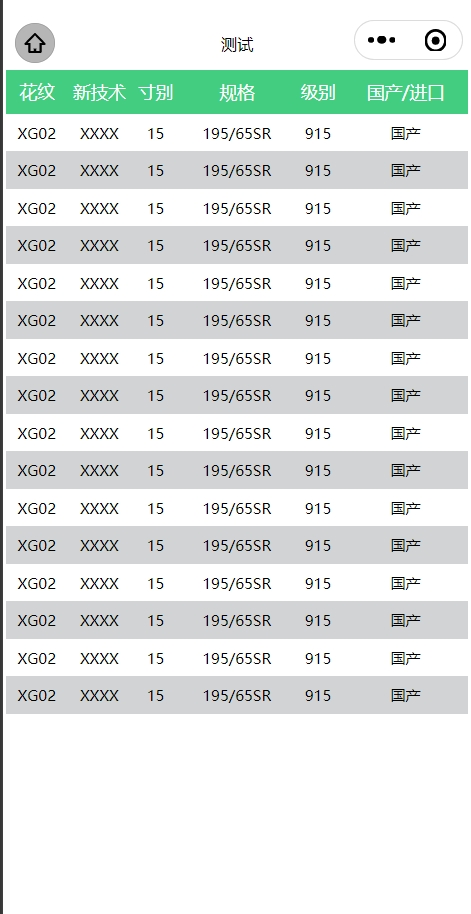

## 简单封装微信小程序的table组件

参数：

## 组件参数文档

| 参数名               | 类型     | 默认值       | 描述                       |
|----------------------|----------|--------------|----------------------------|
| width                | String   | '750rpx'     | 宽度                       |
| height               | String   | 'auto'       | 表格高度                   |
| list                 | Array    | []           | 数据                       |
| header               | Array    | []           | 表头                       |
| headerBgColor        | String   | '#43CD80'    | 表头背景色                 |
| stripe               | Boolean  | true         | 是否斑马纹                 |
| showOperateColumn    | Boolean  | true         | 是否显示操作列             |
| operateColumnWidth   | Number   | 100          | 操作列宽度                 |
| operateColumnLabel   | String   | '操作'       | 操作列标题                 |
| align                | String   | 'center'     | 表格对齐方式               |

## 事件

| 事件名        | 默认返回值    | 描述                                      |
| operate      | {row, index} | 点击操作列时触发，返回当前行数据，当前行索引 |

## 预览

